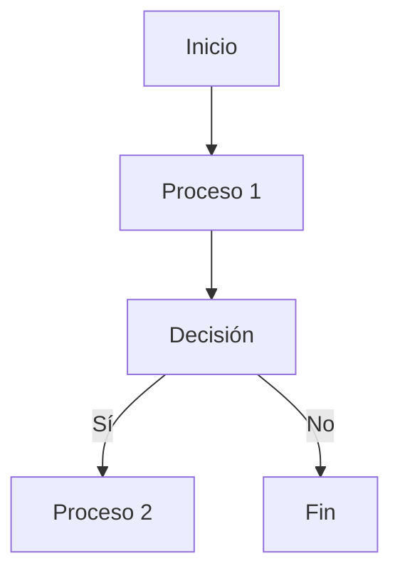
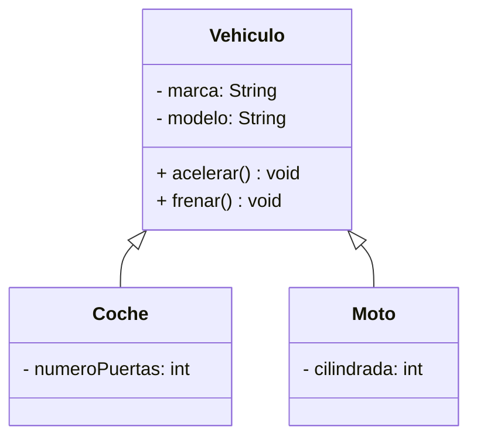

# Ferramentas de Documentación: Markdown

## Introducción a Markdown  

Markdown es un lenguaje de marcado ligero diseñado para facilitar la escritura de texto formateado de manera sencilla y eficiente. Fue creado por John Gruber en 2004 con el objetivo de permitir la escritura de documentos estructurados de forma intuitiva y sin necesidad de etiquetas complicadas como en HTML.  

Es ampliamente utilizado en documentación técnica, blogs, foros y plataformas de desarrollo como GitHub y GitLab. Su simplicidad permite que cualquier persona pueda escribir texto enriquecido sin necesidad de aprender un sistema complejo de formateo.  

### Ventajas de Markdown  

Markdown ofrece diversas ventajas en comparación con otros formatos de documentación, entre las que destacan:  

- **Simplicidad:** Su sintaxis es fácil de aprender y utilizar, incluso para quienes no tienen experiencia en lenguajes de marcado.  
- **Portabilidad:** Los archivos Markdown son simples archivos de texto plano, lo que los hace ligeros y fáciles de compartir.  
- **Conversión sencilla:** Puede convertirse fácilmente a HTML, PDF y otros formatos mediante herramientas como Pandoc.  
- **Compatibilidad con sistemas de control de versiones:** Es ideal para documentar proyectos en GitHub, GitLab y otras plataformas de desarrollo colaborativo.  
- **Legibilidad:** Los documentos en Markdown son comprensibles incluso en su forma sin procesar, lo que facilita la revisión y edición.  

### Usos de Markdown  

Markdown se emplea en una gran variedad de contextos, entre los cuales destacan:  

- **Documentación técnica:** Es utilizado para redactar manuales de usuario, guías de instalación y especificaciones de software.  
- **Repositorios de código:** En plataformas como GitHub y GitLab, se usa para escribir archivos README.md, documentación de proyectos y wikis.  
- **Blogs y artículos:** Sistemas de gestión de contenido como Jekyll, Hugo y Ghost permiten escribir artículos en Markdown y convertirlos a HTML.  
- **Foros y mensajería:** Se usa en plataformas como Discord, Reddit y Stack Overflow para formatear mensajes y comentarios.  
- **Presentaciones y reportes:** Puede combinarse con herramientas como Pandoc o Remark.js para generar diapositivas o informes en PDF.  

Markdown es una herramienta versátil que permite estructurar documentos de forma clara y sencilla sin necesidad de depender de editores de texto avanzados. En las siguientes secciones se abordará su sintaxis y las mejores prácticas para su uso en documentación técnica.

## Sintaxis básica  

Markdown ofrece una sintaxis sencilla para aplicar formato al texto sin necesidad de utilizar etiquetas complejas. A continuación, se explican los elementos fundamentales de su sintaxis.  

### Encabezados  

Los encabezados permiten estructurar el contenido y se crean utilizando el símbolo `#`. La cantidad de `#` determina el nivel del encabezado.  

Ejemplo:  

```plaintext
#### Encabezado de nivel 4
##### Encabezado de nivel 5
###### Encabezado de nivel 6
```

Esto se renderiza como:  

#### Encabezado de nivel 4  

##### Encabezado de nivel 5  

###### Encabezado de nivel 6  

Fíjate que las almohadillas '#' van seguidas de un espacio antes del texto del encabezado.

### Párrafos y saltos de línea  

Para crear un párrafo, basta con escribir el texto seguido de una línea en blanco antes de empezar otro párrafo.  

Si se desea un **salto de línea dentro de un mismo párrafo**, se debe finalizar la línea con dos espacios en blanco antes de presionar Enter.  

Ejemplo:  

```plaintext
Este es un párrafo.

Este es otro párrafo separado por una línea en blanco.  
Esta línea está en el mismo párrafo que la anterior.
```

### Negrita y cursiva

Markdown permite resaltar texto en **negrita** o *cursiva* mediante el uso de asteriscos (`*`) o guiones bajos (`_`).  

Ejemplo:  

```plaintext
**Este texto está en negrita**  
*Este texto está en cursiva*  
__Este también está en negrita__  
_Este también está en cursiva_
***Este texto está en negrita y cursiva***
```

Renderizado:  

**Este texto está en negrita**  
*Este texto está en cursiva*  
__Este también está en negrita__  
_Este también está en cursiva_  
***Este texto está en negrita y cursiva***

### Listas  

Las listas permiten estructurar elementos en un formato organizado.  

#### Listas no ordenadas  

Se crean con `-`, `+` o `*` seguidos de un espacio.  

```plaintext
- Elemento 1
- Elemento 2
  - Sub-elemento 2.1
  - Sub-elemento 2.2
+ Elemento 3
* Elemento 4
```

Renderizado:  

- Elemento 1  
- Elemento 2  
  - Sub-elemento 2.1  
  - Sub-elemento 2.2  
+ Elemento 3  
* Elemento 4  

#### Listas ordenadas  

Se numeran con `1.`, `2.`, `3.`, etc.  

```plaintext
1. Primer elemento
2. Segundo elemento
   1. Sub-elemento 2.1
   2. Sub-elemento 2.2
3. Tercer elemento
```

Renderizado:  

1. Primer elemento  
2. Segundo elemento  
   1. Sub-elemento 2.1  
   2. Sub-elemento 2.2  
3. Tercer elemento  

#### Listas de tareas

Las listas de tareas son un tipo especial de listas en Markdown, utilizadas en plataformas como **GitHub**, **GitLab** y **JIRA** para gestionar pendientes. Se crean usando corchetes `[ ]` para tareas sin completar y `[x]` para las completadas.  

Ejemplo:  

```plaintext
- [ ] Revisar la documentación
- [x] Implementar la funcionalidad principal
- [ ] Escribir pruebas unitarias
- [x] Actualizar el README
```

Renderizado:  

- [ ] Revisar la documentación  
- [x] Implementar la funcionalidad principal  
- [ ] Escribir pruebas unitarias  
- [x] Actualizar el README  

Las listas de tareas son útiles para organizar proyectos y hacer seguimiento de avances en desarrollo de software.  

### Citas y bloque de citas  

Las citas se crean usando el símbolo `>` al inicio de la línea.  

```plaintext
> Esto es una cita.
> Se puede extender en varias líneas.
```

Renderizado:  

> Esto es una cita.  
> Se puede extender en varias líneas.  

Puedes crear citas anidadas, añadiendo un segundo `>` en cada nivel.  

```plaintext
> Esto es una cita.
>> Esta es una cita anidada.
```

Renderizado:

> Esto es una cita.
> > Esta es una cita anidada.
> > Fin de la cita anidada.
> 
> Fin de la cita principal.

Dentro de una cita, puedes usar otros elementos de Markdown, como listas, negritas, cursivas, etc.

```plaintext
> #### Encabezado dentro de la cita
>
> - Elemento 1
> - **Elemento 2**
> - *Elemento 3*
```

Renderizado:

> #### Encabezado dentro de la cita
>
> - Elemento 1
> - **Elemento 2**
> - *Elemento 3*

### Código en línea y bloques de código  

#### Código en línea  

Se utiliza comillas invertidas `` ` `` para resaltar fragmentos de código dentro de un texto.  

```plaintext
Este es un ejemplo de código en línea: `System.out.println("Hola Mundo");`
```

Renderizado:  

Este es un ejemplo de código en línea: `System.out.println("Hola Mundo");`  

#### Bloques de código

Para bloques de código con resaltado de sintaxis, se utilizan tres comillas invertidas ``` antes y después del código, indicando el lenguaje.  

Ejemplo en Java:  

\`\`\`java
public class HolaMundo {
    public static void main(String[] args) {
        System.out.println("Hola Mundo");
    }
}
\`\`\`

Renderizado:  

```java
public class HolaMundo {
    public static void main(String[] args) {
        System.out.println("Hola Mundo");
    }
}
```

Ejemplo en Markdown:  

```plaintext
# Esto es un comentario en Markdown
**Texto en negrita**
- Elemento de lista
```

Estos bloques permiten **resaltar sintaxis** específica según el lenguaje.  

Otros **lenguajes soportados**:

- `plaintext` o `text`
- `bash` o `shell`
- `python`
- `javascript` o `js`
- `html`
- `css`
- `sql`
- `xml`
- ...

### Imágenes y enlaces

Para insertar imágenes en un documento Markdown, se utiliza la siguiente sintaxis:

```plaintext

```

El texto alternativo se muestra si la imagen no puede cargarse o si se visualiza en un lector de pantalla. La URL de la imagen puede ser una dirección web o una ruta relativa al archivo de Markdown.

Ejemplo:

```plaintext

```

Renderizado:


Para crear enlaces a otras páginas web o a secciones dentro del mismo documento, se utiliza la siguiente sintaxis:

```plaintext
[Texto del enlace](URL del enlace)
```

Ejemplo:

```plaintext
[Markdown Guide](https://www.markdownguide.org)
```

Renderizado:

[Markdown Guide](https://www.markdownguide.org)

Si se desea que el enlace se abra en una nueva pestaña del navegador, se puede añadir el atributo `target="_blank"` al enlace:

```plaintext
[Markdown Guide](https://www.markdownguide.org){:target="_blank"}
```

Renderizado:

[Markdown Guide](https://www.markdownguide.org){:target="_blank"}

Puedes añadir un título, en forma de *tooltip*, al enlace, de la siguiente forma:

```plaintext
[Markdown Guide](https://www.markdownguide.org "Guía de Markdown")
```

Renderizado:

[Markdown Guide](https://www.markdownguide.org "Guía de Markdown")

Tambien podemos crear enlaces internos a secciones del mismo documento utilizando el siguiente formato:

```plaintext
[Texto del enlace](#nombre-de-la-seccion)
```

Por ejemplo, para enlazar a la sección "Imágenes y enlaces" de este documento, se utilizaría el siguiente enlace:

```plaintext
[Ir a Imágenes y enlaces](#imágenes-y-enlaces)
```

Renderizado:

[Ir a Imágenes y enlaces](#imágenes-y-enlaces)

Por último, podemos crear enlaces de referencia. Estos se definen al final del documento y se utilizan para referenciar enlaces largos o complejos en el texto. La sintaxis es la siguiente:

```plaintext
[Texto del enlace][nombre de la referencia]
...
[nombre de la referencia]: URL del enlace
```

Ejemplo:

```plaintext
[Markdown Guide][1]
...
[1]: https://www.markdownguide.org
```

Esta sección ha cubierto la sintaxis esencial de Markdown para escribir documentos estructurados y con formato. En la siguiente sección se abordarán las tablas y los enlaces, herramientas clave para mejorar la legibilidad de la documentación.

### Emojis y otros caracteres especiales

En Markdown, se pueden utilizar emojis y otros caracteres especiales para añadir expresividad al texto. Los emojis se escriben entre dos puntos `:` y pueden representar emociones, objetos, animales, entre otros.

Ejemplo:

```plaintext
:smile: :heart: :rocket:
```

Renderizado:

:smile: :heart: :rocket:

Puedes encontrar una lista completa de emojis [**aquí**](https://gist.github.com/rxaviers/7360908)

### Escapado de caracteres

En Markdown, algunos caracteres tienen un significado especial y se utilizan para aplicar formato al texto. Si se desea mostrar estos caracteres de forma literal, es necesario **escaparlos** con una barra invertida `\`.

#### Caracteres que requieren escapado

- `\` (barra invertida)
- `` ` `` (comillas invertidas)
- `*` (asterisco)
- `_` (guion bajo)
- `{` y `}` (llaves)
- `[` y `]` (corchetes)
- `(` y `)` (paréntesis)
- `#` (almohadilla)
- `+` (signo más)
- `-` (guión)
- `.` (punto)
- `!` (signo de exclamación)
- `>` (signo mayor que)
- `<` (signo menor que)
- `~` (virgulilla)
- `|` (barra vertical)
- `&` (ampersand)

Ejemplo:

```plaintext
\*Texto en negrita\*. Añado más caracteres especiales: \` \_ \{ \} \[ \] \( \) \# \+ \- \. \! \> \< \~ \|
```

Renderizado:

\*Texto en negrita\*.  
Añado más caracteres especiales: \` \_ \{ \} \[ \] \( \) \# \+ \- \. \! \> \< \~ \|

Fíjate como no se interpreta el significado del asterisco sino que se muestra literalmente como un carácter más del texto.

### Tablas

Las tablas son una forma efectiva de organizar y presentar datos de manera estructurada. En Markdown, se pueden crear tablas utilizando barras verticales `|` y guiones `-` para separar las celdas y definir los encabezados.

#### Sintaxis básica de tablas

La sintaxis básica de una tabla en Markdown es la siguiente:

```plaintext
| Encabezado 1 | Encabezado 2 | Encabezado 3 |
| ------------ | :----------: | ----------: |
| Celda 1      | Celda 2      | Celda 3     |
| Celda 4      | Celda 5      | Celda 6     |
```

- Las barras verticales `|` se utilizan para separar las celdas.
- La segunda fila define la alineación de cada columna:
  - `:---` indica alineación a la izquierda.
  - `:---:` indica alineación centrada.
  - `---:` indica alineación a la derecha.
  - `---` indica alineación predeterminada a la izquierda.
- Las celdas pueden contener texto, enlaces, imágenes, listas y otros elementos de Markdown.
- Las tablas deben tener al menos tres guiones `-` en la segunda fila para separar los encabezados del contenido.

#### Ejemplo de tabla

A continuación, se muestra un ejemplo de una tabla sencilla en Markdown:

```plaintext
| Nombre    | Edad  | Ciudad    |
| --------: | :---: | :-------- |
| Juan      | 25    | Madrid    |
| María     | 30    | Barcelona |
| Carlos    | 28    | Valencia  |
```

Renderizado:

| Nombre    | Edad  | Ciudad    |
| --------: | :---: | :-------- |
| Juan      | 25    | Madrid    |
| María     | 30    | Barcelona |
| Carlos    | 28    | Valencia  |

La creación de tablas en markdown tiene una serie de limitaciones, como la falta de soporte para celdas combinadas o la limitación en la personalización del estilo. Sin embargo, para tablas sencillas y rápidas, es una herramienta útil y efectiva.

### HTML en Markdown

Una de las ventajas de Markdown es su capacidad para integrar código HTML en un documento. Esto permite añadir elementos de HTML, como estilos, scripts o elementos multimedia, para personalizar la apariencia y funcionalidad del contenido.

#### Sintaxis de HTML en Markdown

Para insertar código HTML en un documento Markdown, se utiliza la siguiente sintaxis:

```plaintext
<etiqueta atributo="valor">Contenido</etiqueta>
```

Donde:

- `<etiqueta>`: Es el nombre de la etiqueta HTML, como `div`, `p`, `a`, `img`, etc.
- `atributo="valor"`: Son los atributos y valores de la etiqueta, como `href`, `src`, `class`, `id`, etc.
- `Contenido`: Es el contenido dentro de la etiqueta, como texto, imágenes, enlaces, listas, etc.
- Se pueden añadir estilos CSS en línea o en un archivo externo para personalizar la apariencia.

#### Ejemplo de HTML en Markdown

A continuación, se muestra un ejemplo de cómo integrar código HTML en un documento Markdown:

```html
<div style="background-color: lightblue; padding: 10px;">
  <h2 style="color: navy;">Título de la sección</h2>
  <p>Este es un párrafo con <a href="https://www.example.com">un enlace</a>.</p>
  
</div>
```

Renderizado:

<div style="background-color: lightblue; padding: 10px;">
  <h2 style="color: navy;">Título de la sección</h2>
  <p>Este es un párrafo con <a href="https://www.example.com">un enlace</a>.</p>
  
</div>

### Markdown extendido  

Además de su sintaxis básica, Markdown admite extensiones que permiten añadir funcionalidades avanzadas como **diagramas**, **código resaltado** y **fórmulas matemáticas**. Estas herramientas son especialmente útiles en documentación técnica y científica.  

#### Diagramas con Mermaid  

[Mermaid](https://mermaid-js.github.io/mermaid/#/) es una librería que permite crear diagramas dentro de Markdown mediante una sintaxis sencilla. Se utiliza en plataformas como GitHub, GitLab y Notion para generar diagramas de flujo, UML, gráficos de Gantt, entre otros.  

Ejemplo de diagrama de flujo en Mermaid:  



Ejemplo de diagrama de clases en Mermaid:  



Los diagramas de Mermaid permiten visualizar estructuras de datos, flujos de procesos y relaciones entre entidades dentro de la documentación. Además, al ser creados mediante texto, pueden modificarse fácilmente sin necesidad de herramientas gráficas complejas.

#### Ecuaciones matemáticas con MathJax  

Markdown permite escribir expresiones matemáticas utilizando MathJax y la sintaxis de [**LaTeX**](https://www.latex-project.org/). Esto es útil para representar fórmulas, ecuaciones y símbolos matemáticos de forma clara y precisa.

Ejemplo de ecuación en línea:  

```plaintext
La ecuación de la relatividad es $E=mc^2$.
```

Renderizado:  

La ecuación de la relatividad es $E=mc^2$.  

Ejemplo de ecuación en bloque:  

```plaintext
$$F = G \frac{m_1 m_2}{r^2}$$
```

Renderizado:  

$$
F = G \frac{m_1 m_2}{r^2}
$$

También podemos utilizar un **bloque de código** para escribir ecuaciones matemáticas en Markdown:

\`\`\`math  
\int_{a}^{b} x^2 dx  
\`\`\`

Renderizado:

```math
\int_{a}^{b} x^2 dx
```

Estas funciones avanzadas amplían las posibilidades de Markdown en entornos científicos y de programación.  

## Referencias

- [Markdown Guide](https://www.markdownguide.org)
- [GitHub Markdown Basics](https://guides.github.com/features/mastering-markdown/)
- [Pandoc - Conversión de documentos](https://pandoc.org)
- [Remark.js - Creación de presentaciones](https://remarkjs.com)
- [Markdown Cheatsheet](https://www.markdownguide.org/cheat-sheet/)
- [Markdown Preview Enhanced - Visual Studio Code](https://shd101wyy.github.io/markdown-preview-enhanced/docs/)
- [Markdown All in One - Visual Studio Code](https://marketplace.visualstudio.com/items?itemName=yzhang.markdown-all-in-one)
- [Markdown Lint - Visual Studio Code](https://marketplace.visualstudio.com/items?itemName=DavidAnson.vscode-markdownlint)
- [Mermaid - Diagramas en Markdown](https://mermaid-js.github.io/mermaid/#/)
- [MathJax - Ecuaciones matemáticas en Markdown](https://www.mathjax.org)