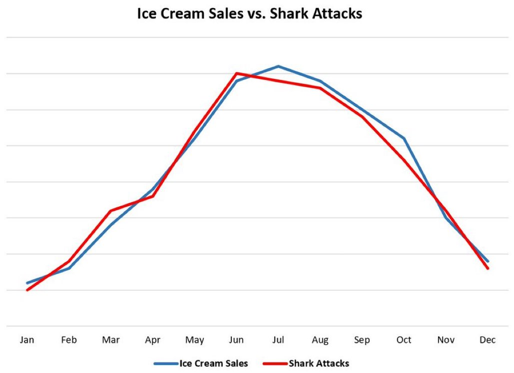

# Herramientas y tecnologías digitales

## Daniel Martiñán Otero

### 25/06/2025

---

### Formación

- Ingeniero en Telecomunicación por la UVigo (2014)
- Master en Profesorado de Educación Secundaria por la UVigo (2023)

### Experiencia profesional

- 2014-2015: Ingeniero de telecomunicaciones en AtlanTTic (Vigo)
    - Comunicaciones avanzadas por sátelite, sistemas de comunicación para drones.
- 2015-2024: Ingeniero de software en CTAG (O Porriño)
    - Diseño e implementación de sistamas ADAS y conducción autónoma.
- 2024-actualidad: Profesor de Formación Profesional en IES de Teis
    - Módulos Programación, Entornos de Desarrollo y Administración de Sistemas Gestores de Bases de Datos de CFGS de DAM, DAW y ASIR.

---

## Indice de contenidos y programación por días

| Contenido | Actividades |
| --------- | ----------- |
| Día 1     | Fundamentos de digitalización, entornos IT/OT y tecnologías habilitadoras digitales. 5G. Cloud & Edge computing. RV y RA. Herramientas. |
| Día 2     | Ciberseguridad y protección de datos. Proyecto de transformación digital. Pensamiento computacional. Productividad. Herramientas |

---

## Objetivos del curso

- Conocer los fundamentos de la digitalización aplicada a los sectores productivos, así como las tecnologías habilitadoras digitales.
- Identificar procesos de digitalización en el ámbito profesional.
- Familiarizarse con herramientas digitales que facilitan la digitalización de procesos.
- Conocer y aplicar nuevas herramientas digitales que utilizar como parte de la docencia del módulo de digitalización aplicada a los sectores productivos.
- Promover el uso de estas herramientas digitales el nuestro alumnado.

---

## ¿Qué no podemos esperar de este curso?

- Profundizar en cada una de las tecnologías digitales.
- Convertirse en un experto en ciberseguridad.
- Aprender a programar.
- Implementar un proyecto de transformación digital completo.
- Conocer todas las herramientas digitales disponibles.
- Convertirnos en expertos en ninguna de las herramientas digitales que mencionemos.

---

## Introducción a la digitalización

> ¿Qué entendemos por digitalización?

---

## Introducción a la digitalización

La **digitalización** es el proceso mediante el cual una organización transforma sus **procesos**, **productos** y **modelos de negocio** aprovechando las **tecnologías digitales**. No se trata solo de utilizar ordenadores o software, sino de **repensar cómo opera una empresa** a partir de los datos, la conectividad y la automatización.

---

## Introducción a la digitalización

| **Informatización** | **Digitalización** |
|----------------------|---------------------|
| Introducción de herramientas informáticas básicas (ERP, ofimática). | Rediseño profundo de procesos usando tecnologías avanzadas. |
| El proceso sigue siendo manual, pero asistido. | El proceso se automatiza o se transforma. |
| Afecta a áreas concretas. | Afecta a toda la organización (visión sistémica). |

---

## Impacto de la digitalización

- Uso de **sensores**, **redes de datos**, **analítica**, **IA**, **cloud**, etc.
- Aumento de la **productividad** sin aumentar costes.
- Mejora de la **sostenibilidad** mediante optimización energética.
- Necesidad de **nuevas competencias** digitales en todos los niveles.
- Nuevos **roles digitales** (data analyst, integrador OT, ingeniero de datos…).
- Desaparición o transformación de tareas rutinarias.
- Modelos organizativos más **horizontales** y colaborativos.
- Cambios en la **comunicación interna** y en la relación con clientes y proveedores.

---

## Introducción a la digitalización

La digitalización permite crear modelos como:

- **Servicios como producto** (as-a-service).
- **Personalización masiva** basada en datos.
- **Producción flexible bajo demanda**.
- Plataformas colaborativas de innovación.

Digitalizar no solo es cuestión de tecnología, sino de **personas**:

- Se necesita una mentalidad abierta al **cambio y aprendizaje continuo**.
- Fomento del trabajo en equipo entre perfiles técnicos, IT y producción.
- Reducción del miedo al error y mayor enfoque experimental.

---

## Introducción a la digitalización

Ejemplos de procesos digitalizados:

- **Producción inteligente**: fábricas conectadas con sensores IoT que monitorizan en tiempo real.
- **Logística optimizada**: seguimiento de mercancías con RFID y análisis predictivo de demanda.
- **Atención al cliente automatizada**: chatbots que resuelven consultas frecuentes.
- **Mantenimiento predictivo**: análisis de datos de máquinas para anticipar fallos.
- **Marketing personalizado**: campañas basadas en el comportamiento del usuario.
- **Gestión de proyectos colaborativa**: uso de herramientas digitales para coordinar equipos distribuidos.
- **Formación continua**: plataformas de e-learning que permiten a los empleados actualizar sus habilidades.
- **Teletrabajo y colaboración remota**: uso de videoconferencias y herramientas colaborativas para equipos distribuidos.
- **Análisis de datos**: uso de herramientas de Big Data para extraer insights de grandes volúmenes de información.

---

## Módulo de Digitalización aplicada a los sectores productivos

- [Real Decreto 659/2023, de 18 de julio, por el que se desarrolla la ordenación del Sistema de Formación Profesional.](https://www.boe.es/eli/es/rd/2023/07/18/659/dof/spa/pdf)
    - Anexos VI y VII: Currículo de los títulos de formación profesional de grado medio y grado superior en Digitalización aplicada a los sectores productivos.
- [Resolución XXX da Dirección Xeral de Formación Profesional, pola que se ditan instruccións sobre a ordenación e a organización dos graos D e E de formación profesional para o curso 2025-2026 (pendente de publicación)](/documentos/Resolucion_ordenacion_graos_D_e_E.pdf).

---

## Módulo de Digitalización aplicada a los sectores productivos

Comparativa de contenidos para GM y GS:

| Contenido | GM | GS |
| --------- | -- | -- |
| Fundamentos de digitalización | Introducción a la digitalización, economía circular, tecnologías habilitadoras | Profundización en IT/OT, IA, Big Data, ciberseguridad |
| Cloud & Edge computing | Descripción básica de tecnologías | Análisis de impacto en sistemas digitales y negocio |

---

## Módulo de Digitalización aplicada a los sectores productivos

Comparativa de contenidos para GM y GS:

| Contenido | GM | GS |
| --------- | -- | -- |
| Ciberseguridad | Protección de datos, brechas de seguridad | Evaluación de riesgos, diseño de sistemas seguros |
| Proyecto de transformación digital | Transformación básica a modelo 4.0, diagramas de bloques | Proyecto integral con alineación estratégica, análisis de recursos humanos |

---

## Módulo de Digitalización aplicada a los sectores productivos

- **Habilidades desarrolladas**:
    - **GM**: Identificación de tecnologías, elaboración de informes de viabilidad simples.
    - **GS**: Análisis crítico de datos, diseño de proyectos complejos, evaluación de impacto en competitividad y sostenibilidad.

**En GM los RA son más descriptivos**, mientras que en **GS son más analíticos**.

---

## Digitalización, automatización, informatización y transformación digital

| Concepto                   | Definición resumida                                                                  | Exemplo                                                             |
| -------------------------- | ------------------------------------------------------------------------------------ | ------------------------------------------------------------------- |
| **Informatización**        | Sustitución de procesos manuales por sistemas informáticos                           | Usar una hoja de cálculo para registrar datos en vez de papel       |
| **Automatización**         | Ejecución automática de tareas o procesos repetitivos                              | Un brazo robótico que envasa productos de forma autónoma             |
| **Digitalización**         | Uso de las TIC para transformar procesos, mejorar la eficiencia o crear valor          | Control remoto de parámetros de un reactor químico                    |
| **Transformación digital** | Cambio profundo de cultura, estructura y modelos de negocio mediante la digitalización | Implantación de soluciones IoT y análisis predictivo en toda la planta |

---

## Entornos IT y OT

- **Entornos IT** : tecnologías de la **información**, enfocadas en la **gestión de datos** y procesos empresariales.
    - Administración de sistemas, redes o bases de datos
    - Desarrollo de software, ciberseguridad, análisis de datos.
    - Gestion de la información empresarial, como ERP, CRM, etc.
    - Ingeniería de software.
- **Entornos OT**: tecnologías operativas, centradas en el **control** y **supervisión** de procesos físicos.
    - Sistemas de control industrial, como PLCs, SCADA, DCS.
    - Sensores, actuadores y dispositivos conectados a máquinas.
    - Supervisión y control de procesos industriales.
    - Seguridad industrial.
    - Control de procesos físicos.

---

## Entornos IT y OT

Transformación digital implica la **convergencia** de ambos entornos:

- **Integración de sistemas IT y OT** para una gestión más eficiente.
- **Nuevos roles** que combinan habilidades de ambos mundos (ej. ingeniero de datos, integrador IT/OT).
- **Necesidad de formación continua** en tecnologías emergentes y ciberseguridad.

**¿Por qué ahora?** Porque la **madurez** de las tecnologías actuales lo permiten:

- Avances en IIoT, Big Data, IA y cloud computing.
- Obtención y procesado de datos en tiempo real.

---

## Entornos IT y OT

Desafíos de la convergencia IT/OT:

- **Seguridad**: Integrar sistemas con diferentes niveles de seguridad.
- **Interoperabilidad**: Heterogeneidad de tecnologías y protocolos.
- **Cambio cultural**: Diferencias en mentalidad y formación entre equipos IT y OT.
- **Capacitación**: Necesidad de formación continua en nuevas tecnologías y ciberseguridad.

---

## Tecnologías habilitadoras digitales

Las **tecnologías habilitadoras digitales** son herramientas y sistemas que permiten la digitalización de procesos y la creación de nuevos modelos de negocio. Algunas de las más relevantes son:

- **Internet de las Cosas (IoT)**: Conexión de dispositivos físicos a internet para recopilar y compartir datos.
- **Inteligencia Artificial (IA)**: Algoritmos que permiten el análisis de datos, la automatización de procesos y la toma de decisiones inteligentes.
- **Big Data**: Procesamiento y análisis de grandes volúmenes de datos para extraer información valiosa.
  
---

## Tecnologías habilitadoras digitales

- **Cloud Computing**: Servicios de computación en la nube que permiten el almacenamiento, procesamiento y análisis de datos sin necesidad de infraestructura local.
- **Blockchain**: Tecnología de registro distribuido que garantiza la seguridad y trazabilidad de las transacciones digitales.
- **Realidad Aumentada y Virtual (AR/VR)**: Tecnologías que permiten crear experiencias inmersivas y visualizaciones avanzadas de datos.
- **Ciberseguridad**: Conjunto de medidas y tecnologías para proteger los sistemas digitales y los datos frente a amenazas y ataques.

---

## Tecnologías habilitadoras digitales

- **5G y conectividad avanzada**: Redes de alta velocidad que permiten la transmisión de grandes volúmenes de datos en tiempo real.
- **Robótica y automatización**: Sistemas que permiten la ejecución automática de tareas repetitivas o peligrosas.
- **Impresión 3D**: Fabricación aditiva que permite crear objetos físicos a partir de modelos digitales.

---

## Tecnologías habilitadoras digitales

- **Edge Computing**: Procesamiento de datos cerca del lugar donde se generan, reduciendo la latencia y mejorando la eficiencia.
- **Sistemas Ciberfísicos (CPS)**: Integración de componentes físicos y digitales que permiten el control y monitorización en tiempo real de procesos industriales.
- **Interfaces de usuario avanzadas (HMI)**: Sistemas que mejoran la interacción entre humanos y máquinas, facilitando el control y supervisión de procesos.
- **Simulación digital (Digital Twin)**: Réplicas virtuales de sistemas físicos que permiten simular y optimizar procesos antes de implementarlos en el mundo real.
- **Tecnologías hápticas**: Dispositivos que permiten la interacción táctil con sistemas digitales, mejorando la experiencia del usuario.

---

## Tecnologías habilitadoras digitales

Ejemplos de aplicación de las TDH:

| TDH                 | Ejemplo                                       |
| ------------------- | --------------------------------------------- |
| IoT                 | Sensores que controlan temperatura y presión en un reactor químico. |
| Big Data            | Análisis de datos históricos para optimizar fórmulas de mezcla. |
| IA                  | Algoritmos que detectan desviaciones en la calidad del producto. |
| Cloud Computing     | Acceso a sistemas SCADA desde la nube para supervisión remota. |

---

## Tecnologías habilitadoras digitales

Ejemplos de aplicación de las TDH:

| TDH                 | Ejemplo                                       |
| ------------------- | --------------------------------------------- |
| Robótica avanzada   | Brazo robótico que realiza tareas peligrosas en laboratorio. |
| Simulación digital  | Réplica virtual de una línea de producción para probar cambios. |
| RA/RV               | Formación en realidad virtual sobre protocolos de seguridad química. |
| Fabricación aditiva | Impresión 3D de piezas de recambio para equipos industriales. |
| Ciberseguridad     | Protección de sistemas OT frente a accesos no autorizados. |

---

## Tecnologías habilitadoras digitales

Ejemplos de aplicación de las TDH:

| TDH                 | Ejemplo                                       |
| ------------------- | --------------------------------------------- |
| Edge Computing      | Procesamiento local de datos de sensores para alertas inmediatas. |
| Blockchain          | Registro seguro de transacciones en la cadena de suministro. |
| Sistemas Ciberfísicos | Control y monitorización en tiempo real de procesos industriales. |
| Interfaces HMI      | Pantallas táctiles que facilitan la interacción con maquinaria. |

---

## Tecnologías habilitadoras digitales

Ideas clave:

- Las TDH no son sólo "gadgets" o modas, sino herramientas que transforman la forma en que operan las empresas.
- Es importante conocer los casos de uso y aplicaciones reales en la industria.
- Conocer las TDH nos permite identificar oportunidades de aplicación o mejora.
- La combinación de varias TDH puede generar sinergias y soluciones innovadoras.
- Promover el pensamiento digital, análisis de datos, automatización y diseño eficiente y seguro de procesos.

---

## Redes 5G y conectividad avanzada

Tecnología 5G &rarr; Salto cualitativo frente a generaciones anteriores:

- **Mayor velocidad**: Hasta 10 Gbps, lo que permite la transmisión de grandes volúmenes de datos en tiempo real.
- **Baja latencia**: Menos de 1 ms, ideal para aplicaciones críticas como control industrial o vehículos autónomos.
- **Conexiones masivas**: Soporta millones de dispositivos conectados simultáneamente, facilitando el IoT a gran escala.
- **Mayor fiabilidad**: Redes más robustas y seguras, con menor probabilidad de caídas o interrupciones.

---

## Redes 5G y conectividad avanzada

Evolución de las redes móviles:

| Generación | Velocidad máxima | Latencia | Conexiones por km² | Aplicaciones clave |
| ---------- | ---------------- | -------- | ------------------ | ------------------ |
| 1G         | 2.4 kbps         | Alta     | Limitada | Voz analógica |
| 2G         | 64 kbps          | Media    | 2,000              | SMS, voz digital   |
| 3G         | 2 Mbps           | Baja     | 10,000             | Navegación web, multimedia |
| 4G         | 1 Gbps           | Muy baja | 100,000         | Streaming, aplicaciones móviles |
| 5G         | 10 Gbps          | Ultra baja | 1,000,000 | IoT masivo, vehículos autónomos, realidad aumentada |

---

## Redes 5G y conectividad avanzada

Otras características clave de 5G:

- **Arquitectura de red flexible**: Permite crear redes virtuales personalizadas para diferentes aplicaciones (network slicing).
- **Bajo consumo energético**: Optimización del uso de recursos, ideal para dispositivos IoT.
- **Edge computing integrado**: Procesamiento de datos cerca del dispositivo, reduciendo latencia y mejorando eficiencia.
- **Seguridad mejorada**: Protocolos avanzados para proteger la privacidad y los datos de los usuarios.

---

## Redes 5G y conectividad avanzada

Esto permite a una fábrica:

- Conectar miles de sensores y dispositivos IoT para monitorizar en tiempo real.
- Implementar sistemas de control industrial con latencia mínima, evitando cableados.
- Utilizar realidad aumentada para formación y asistencia técnica remota.
- Implementar vehículos autónomos para transporte de materiales dentro de la planta.
- Crear redes privadas 5G para mayor seguridad y control de datos.
- Integrar sistemas de ciberseguridad avanzados para proteger la infraestructura crítica.

---

## Redes 5G y conectividad avanzada

Limitaciones y desafíos:

- **Infraestructura y cobertura**: Requiere una inversión significativa en infraestructura y despliegue de antenas.
- **Compatibilidad de dispositivos**: No todos los dispositivos actuales son compatibles con 5G
- **Costes de implementación**: Aunque a largo plazo puede reducir costes operativos, la inversión inicial es alta.
- **Consumo energético**: Aunque es más eficiente, la infraestructura 5G puede consumir más energía que las generaciones anteriores.
- **Complejidad tecnológica**.

---

## Redes 5G y conectividad avanzada

**Redes 6G**, qué se espera:

- **Velocidades de hasta 100 Gbps**.
- **Latencia de menos de 1 ms**.
- **Conexiones masivas**: Soporte para billones de dispositivos conectados.
- **Integración de IA y machine learning** en la red para optimización automática.
- **Realidad aumentada y virtual inmersiva** como estándar.
- **Conectividad global**: Redes que funcionen en cualquier parte del mundo, incluso en zonas remotas.

---

## Redes 5G y conectividad avanzada

5G y salud: entre el rigor científico y la percepción pública

- **Investigación científica**: La mayoría de estudios concluyen que las radiaciones de 5G están muy por debajo de los límites seguros establecidos por la OMS. Radiación **no ionizante**.
- Bulos:
    - No hay evidencia científica que respalde la relación entre 5G y problemas de salud como el COVID-19.
    - La exposición a campos electromagnéticos de 5G es similar o inferior a la de tecnologías anteriores.
    - Importante fomentar el pensamiento crítico y la alfabetización mediática para combatir la desinformación.

---

## Redes 5G y conectividad avanzada

---

## Redes 5G y conectividad avanzada

### ¿Es peligrosa la radiación del 5G?

Una comparación con otras fuentes comunes de radiación electromagnética:

| Dispositivo / Fuente     | Frecuencia típica     | Potencia de emisión aprox. | Tipo de radiación | Distancia habitual |
|--------------------------|------------------------|-----------------------------|--------------------|--------------------|
| Microondas doméstico     | 2,45 GHz               | 600–1200 W                  | No ionizante       | 30–50 cm           |
| Estación base 5G (urbana)| 3,5 GHz / 26 GHz       | 10–40 W por antena          | No ionizante       | 50–300 m           |
| Móbil (4G/5G)            | 0,8–3,5 GHz            | 0,2–2 W                     | No ionizante       | En contacto        |
| Router Wi-Fi             | 2,4–5 GHz              | 0,1–0,5 W                   | No ionizante       | 1–10 m             |
| Luz del sol (UV)         | 800 THz (UV-C)        | Variable (dependiendo de la exposición) | **Ionizante (UV-C)**   | 150 millones km     |

---

## Redes 5G y conectividad avanzada

### ¿Es peligrosa la radiación del 5G?

> **Conclusión**:
> 
> - Todas estas fuentes emiten **radiación no ionizante** (no rompe el ADN).
> - La potencia del 5G es mucho menor que la de un microondas.
> - Los límites de exposición están **ampliamente regulados** (ICNIRP, OMS, UE).

---

## Digitalización y bulos

Aprovechando el tema sobre el efecto de la radiación del 5G sobre la salud y su cuestionamiento desde la comunidad científica, podemos abordar la importancia de la **alfabetización mediática** y el **pensamiento crítico** en la era digital en nuestras aulas.

- Podemos hablar de los **bulos** o ***fake news*** y niveles de desinformación:
    - **Bulos**: Información falsa creada con la intención de engañar.
    - **Desinformación**: Información falsa o engañosa difundida intencionadamente.
    - **Malinformación**: Información verdadera pero presentada de forma engañosa o fuera de contexto.
- Podemos dar herramientas sobre cómo identificar bulos:
    - Verificar la **fuente de la información**.
    - Comprobar si hay **evidencia científica** que respalde la afirmación.
    - Buscar **opiniones de expertos** en el tema.
    - **Contrastarlo con fuentes fiables** y contrastadas.

---

## Digitalización y bulos

- Herramientas de verificación y fact-checking:
    - **[FactCheck.org](https://www.factcheck.org/)**: Verifica afirmaciones políticas y noticias.
    - **[Snopes](https://www.snopes.com/)**: Investiga rumores y leyendas urbanas.
    - **[Maldita.es](https://maldita.es/)**: Plataforma en español que verifica información viral.

---

## Digitalzación y bulos - Falacias lógicas

| Falacia lógica          | Descripción                                                                 | Ejemplo                                                                 |
|-------------------------|-----------------------------------------------------------------------------|-------------------------------------------------------------------------|
| **Ad Hominem**          | Atacar a la persona en lugar de sus argumentos.                             | "No puedes confiar en su opinión sobre el 5G, es un ingeniero sin experiencia." |
| **Falsa dicotomía**     | Presentar dos opciones como las únicas posibles.                           | "O estás a favor del 5G o estás en contra del progreso."              |
| **Apelación a la autoridad** | Usar la opinión de una figura famosa como prueba de verdad. | "El famoso actor dijo que el 5G es peligroso, por lo tanto debe ser cierto." |
| **Falsa causa**         | Asumir que una cosa causa otra sin evidencia suficiente. | "Desde que se instaló el 5G, ha aumentado el número de resfriados." |
| **Apelación al miedo**  | Usar el miedo para persuadir sin argumentos sólidos.                       | "Si no detenemos el 5G, nuestra salud estará en grave peligro."       |
| **Hombre de paja**     | Distorsionar el argumento del oponente para atacarlo más fácilmente. | "Los defensores del 5G dicen que no hay riesgos, pero eso es irresponsable." |

---

## Digitalización y bulos - Falacias lógicas

---

## Redes 5G y conectividad avanzada

**IoT y 5G**: una combinación poderosa

- **IoT**: Conexión de dispositivos físicos a internet para recopilar y compartir datos.
- **5G**: Red de alta velocidad y baja latencia que permite la transmisión masiva de datos en tiempo real.
- **Sinergia**: 5G potencia el IoT al permitir la conexión de millones de dispositivos simultáneamente, facilitando aplicaciones como:
    - **Ciudades inteligentes**: Sensores que monitorizan tráfico, calidad del aire, alumbrado público.
    - **Agricultura de precisión**: Sensores que controlan humedad, temperatura y nutrientes del suelo.
    - **Salud conectada**: Dispositivos médicos que envían datos en tiempo real a profesionales sanitarios.
    - **Logística inteligente**: Seguimiento en tiempo real de mercancías y optimización de rutas.

---

## Redes 5G y conectividad avanzada

Herramientas de aula:

- Simuladores de redes 5G:
    - **Cisco Packet Tracer**: Permite simular redes y dispositivos IoT.
    - **GNS3**: Simulación avanzada de redes, incluyendo 5G.
- Dispositivos:
    - Router 5G portátil.
    - Dispositivos IoT con conectividad 5G (demo kits).
- Herramientas de medición:
    - **[Speedtest](https://www.speedtest.net/es)**: Para medir la velocidad de conexión 5G.
    - **[CellMapper](https://www.cellmapper.net/map)**: Aplicación para mapear cobertura de redes móviles.

---

## Cloud & Edge Computing

**¿Qué es la nube?** Conjunto de servicios digitales accesibles a través de internet, que permiten almacenar, procesar y analizar datos sin necesidad de infraestructura local.

- Pueden ser públicos (ofrecidos por terceros como AWS, Google Cloud, Azure) o privados (infraestructura propia de la empresa).

---

## Cloud & Edge Computing

**¿Que es cloud computing?** Modelo de prestación de servicios digitales (almacenamiento, procesamiento, redes, aplicaciones, etc.) a través de Internet, bajo demanda y con pago por uso.

- No toda la nube es cloud computing, ya que este último implica un modelo de servicio específico.

---

## Cloud & Edge Computing

### Tipos de servicios en la nube

- **IaaS (Infraestructura como servicio)**: Proporciona **recursos de infraestructura** como servidores, almacenamiento y redes.
    - Ejemplos: Amazon EC2, Google Compute Engine.
    - Permite a las empresas **alquilar recursos de computación** sin necesidad de comprar hardware.
- **PaaS (Plataforma como servicio)**: Ofrece un entorno de desarrollo y despliegue de aplicaciones.
    - Ejemplos: Heroku, Google App Engine.
    - Facilita a los desarrolladores crear aplicaciones sin preocuparse por la infraestructura subyacente.

---

## Cloud & Edge Computing

### Tipos de servicios en la nube

- **SaaS (Software como servicio)**: Proporciona aplicaciones accesibles a través de internet. 
    - Ejemplos: Google Workspace, Microsoft 365, Salesforce.
    - Permite a los usuarios acceder a software sin necesidad de instalarlo localmente. Solemos referirnos a aplicaciones que nos permiten crear, editar, almacenar y compartir información. No consideramos a aplicaciones como Redes Sociales, mensajería instantánea o plataformas de contenido.
- **DaaS (Datos como servicio)**: Proporciona acceso a datos y bases de datos a través de la nube.
    - Ejemplos: Amazon RDS, Google BigQuery.
    - Facilita el análisis y gestión de grandes volúmenes de datos sin necesidad de infraestructura local.

---

## Cloud & Edge Computing

Algunos ejemplos de SaaS:

| Servicio SaaS         | Descripción                                       |
| --------------------- | ------------------------------------------------- |
| Google Workspace      | Suite de productividad en la nube (Docs, Sheets, Drive) |
| Microsoft 365         | Suite de productividad y colaboración (Word, Excel, Teams) |
| Salesforce            | CRM en la nube para gestión de clientes y ventas |
| Slack                 | Plataforma de comunicación y colaboración empresarial |
| Zoom                  | Plataforma de videoconferencias y reuniones online |

---

## Cloud & Edge Computing

Más ejemplos de SaaS:

| Servicio SaaS         | Descripción                                       |
| --------------------- | ------------------------------------------------- |
| Dropbox               | Almacenamiento y compartición de archivos en la nube |
| Trello                | Herramienta de gestión de proyectos y tareas colaborativas |
| Notion               | Plataforma de organización y gestión de información personal y de equipo |
| Canva                | Herramienta de diseño gráfico y creación de contenidos visuales |
| ChatGPT              | Asistente virtual basado en IA para generación de texto y conversación |
---

## Cloud & Edge Computing

### Edge, Fog y Mist Computing

- **Edge Computing**: Procesamiento de datos **cerca del lugar donde se generan**, sin necesidad de enviar todo a la nube.
    - Ejemplo: En una planta química, sensores que detectan fugas o temperatura anómala procesan la información en un microcontrolador local, generando alertas inmediatas.
- **Fog Computing**: Arquitectura intermedia entre dispositivos de borde y la nube. Se usan gateways o nodos locales de procesamiento.
- **Mist Computing**: Procesamiento ultra-local, casi en el dispositivo sensor (nivel más bajo del borde).

---

## Edge computing

Ventajas del Edge Computing:

- **Reducción de latencia**: Procesamiento local evita el tiempo de ida y vuelta a la nube.
- **Ahorro de ancho de banda**: Solo se envían a la nube los datos relevantes, reduciendo el tráfico de red.
- **Mayor seguridad**: Los datos sensibles pueden procesarse localmente sin necesidad de enviarlos a la nube.
- **Resiliencia**: El sistema puede seguir funcionando aunque la conexión a la nube se interrumpa.
- **Escalabilidad**: Permite añadir más dispositivos y sensores sin necesidad de aumentar la capacidad de la nube.

---

## Edge computing

---

## Edge, fog y mist computing

---

## Cloud & Edge Computing

### Centros de datos

- **Qué son**: Instalaciones físicas que albergan servidores, almacenamiento y sistemas de red.
- **Elementos clave**: Climatización, redundancia eléctrica, seguridad física y lógica, monitorización.
- **Impacto ambiental**: a tener en cuenta el **consumo energético y la sostenibilidad** de los centros de datos.

---

## Software as a Service (SaaS)

- **Qué es**: Modelo de entrega de software donde las aplicaciones se alojan en la nube y se accede a ellas a través de internet.

> Sustituye a las aplicaciones instaladas localmente, permitiendo el acceso desde cualquier dispositivo con conexión a internet.

- **Ventajas**:
    - Acceso desde cualquier lugar y dispositivo.
    - Actualizaciones automáticas y mantenimiento a cargo del proveedor.
    - Escalabilidad: se puede aumentar o reducir el uso según las necesidades.
    - Reducción de costes de infraestructura y licencias.
    - Integración sencilla con otras aplicaciones y servicios en la nube.
    - Colaboración en tiempo real entre usuarios.

---

## Google Suite & Microsoft 365

- **Google Workspace**: Conjunto de aplicaciones en la nube para productividad y colaboración.
    - Incluye Gmail, Google Drive, Docs, Sheets, Slides, Calendar, Meet.
    - Permite trabajar en documentos compartidos en tiempo real.
    - Integración con otras herramientas de Google y terceros.
-  **Microsoft 365**: Suite de productividad y colaboración de Microsoft.
    - Incluye Outlook, OneDrive, Word, Excel, PowerPoint, Teams.
    - Integración con aplicaciones de escritorio y servicios en la nube.
    - Herramientas avanzadas de colaboración y comunicación.

---

## Google Suite & Microsoft 365

| Característica         | Google Workspace                          | Microsoft 365                             |
| ---------------------- | ----------------------------------------- | ----------------------------------------- |
| Correo electrónico      | Gmail                                     | Outlook                                   |
| Almacenamiento en la nube | Google Drive                              | OneDrive                                  |
| Documentos colaborativos | Google Docs, Sheets, Slides               | Word, Excel, PowerPoint                   |
| Videoconferencias       | Google Meet                               | Microsoft Teams                           |
| Calendario              | Google Calendar                           | Outlook Calendar                          |
| Integración             | Con otras aplicaciones de Google y terceros | Con aplicaciones de Microsoft y terceros  |

---

## Google Suite & Microsoft 365

Es importante saber manejar las herramientas ofimáticas (tanto la opción de Google como la de Microsoft), ya que son ampliamente utilizadas en el ámbito profesional y académico. Esto implica:

- Saber crear, editar y compartir documentos de texto, hojas de cálculo y presentaciones.
- Conocer las funcionalidades avanzadas como tablas dinámicas, gráficos, fórmulas y funciones.
- Saber crear documentos bien formateados y presentaciones visualmente atractivas.

Además, fomentan la colaboración y la productividad en entornos de trabajo modernos.

- **Trabajo colaborativo**
- **Teletrabajo**
- **Almacenamiento en la nube**
- **Accesibilidad desde cualquier dispositivo**
- **Integración con otras herramientas**
- **Características avanzas**

---

## Google Suite

Algunas funcionalidades avanzadas o menos conocidas de Google Workspace:

- **Google Apps Script**: Permite automatizar tareas y crear aplicaciones personalizadas dentro de Google Workspace.

---

## Google Suite

Algunas funcionalidades avanzadas o menos conocidas de Google Workspace:

- **Versionado e historial de cambios**: Permite ver y restaurar versiones anteriores de documentos en Google Docs, Sheets y Slides.

---

## Google Suite

Algunas funcionalidades avanzadas o menos conocidas de Google Workspace:

- **Complementos (Add-ons)**: Extensiones que añaden funcionalidades a las aplicaciones de Google Workspace, como plantillas, herramientas de análisis o integración con otras aplicaciones.

---

## Google Suite

Algunas funcionalidades avanzadas o menos conocidas de Google Workspace:

- **Formato markdown**: Permite aplicar formato a los documentos de Google Docs utilizando una sintaxis sencilla, facilitando la edición rápida de texto.

---

## Otras Tecnologías Habilitadoras Digitales

- **Realidad Virtual (VR)**: Entornos completamente virtuales que permiten simular situaciones y procesos.
    - Dispositivos: gafas VR, controladores de movimiento.
    - Aplicaciones de uso: formación en entornos peligrosos, simulación de procesos industriales.
- **Gemelos digitales (Digital Twins)**: Réplicas virtuales de sistemas físicos que permiten simular y optimizar procesos.
    - Dispositivos: sensores IoT, plataformas de simulación.
    - Aplicaciones de uso: monitorización en tiempo real, análisis predictivo, optimización de mantenimiento.
    - [Self Driving Vehicles Powered by Digital Twins](https://www.youtube.com/watch?v=MWz2qY1kulQ)
    - [Industrial Digital Twins for Simulating Robot Fleets](https://www.youtube.com/watch?v=IuWk0C3MzBQ)

---

## Otras Tecnologías Habilitadoras Digitales

  - **Realidad Aumentada (AR)**: Superposición de información digital sobre el mundo real, útil para formación y mantenimiento.
    - **Dispositivos**: gafas AR: Microsoft HoloLens, Meta Quest, Apple Vision Pro, Meta Ray-Ban.
    - **Aplicaciones de uso**: asistencia técnica, formación inmersiva, visualización de datos en tiempo real.

Ejemplos de uso:

- [Mercedes Class-S Head-Up Display with AR](https://www.youtube.com/watch?v=DCgy3askMcM)
- [Apple Vision Pro - First Look](https://www.youtube.com/watch?v=2Q9a1b3g0eY)

---

## Otras Tecnologías Habilitadoras Digitales

- **Realidad Mixta (MR)**: Combinación de AR y VR, donde objetos virtuales interactúan con el mundo real.
    - Dispositivos: Microsoft HoloLens, Magic Leap.
    - Aplicaciones de uso: diseño colaborativo, mantenimiento asistido.
