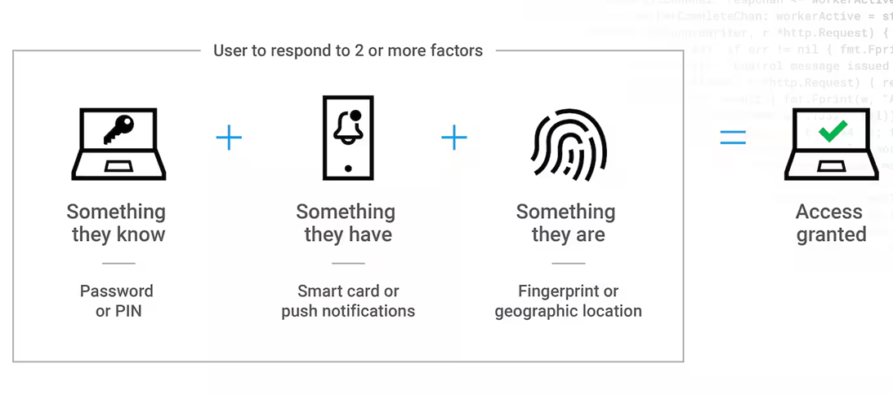

# Herramientas y tecnologías digitales

## Daniel Martiñán Otero

#### danielmartinan@edu.xunta.gal

 

### 26/06/2025

---

## Indice de contenidos y programación por días

| Contenido | Actividades |
| --------- | ----------- |
| Día 1     | Fundamentos de digitalización, entornos IT/OT y tecnologías habilitadoras digitales. 5G. Cloud & Edge computing. RV y RA. Herramientas. |
| Día 2     | Ciberseguridad y protección de datos. Proyecto de transformación digital. Pensamiento computacional. Productividad. Herramientas |

---

## Ciberseguridad y protección de datos

La digitalización trae consigo nuevos retos en términos de **ciberseguridad** y **protección de datos**. Es importante entender qué entendemos por datos e información.

- **Dato**: representación simbólica, numérica, alfabética o de otro tipo de una entidad, fenómeno o hecho. Por sí solo, un dato carece de significado contextual.
- **Información**: surge cuando los datos son organizados, interpretados y contextualizados para generar un conocimiento útil. Por ejemplo, "La temperatura actual es de 23°C" o "El semáforo está en rojo" son informaciones que derivan de datos y permiten tomar decisiones o comprender situaciones.

---

## Ciberseguridad y protección de datos

### Ciclo de vida de los datos

- **Creación o adquisición**: Los datos pueden ser generados por sensores, introducidos manualmente mediante formularios, capturados por dispositivos IoT o descargados desde bases de datos externas.
- **Almacenamiento**: Los datos se guardan en estructuras como bases de datos relacionales, sistemas NoSQL, data lakes o en la nube, según sus características y volumen.
- **Procesamiento**: Consiste en limpiar, transformar y preparar los datos para su análisis. Esto incluye la eliminación de errores, el tratamiento de valores nulos y la normalización.
- **Análisis**: Una vez preparados, los datos se analizan para extraer patrones, correlaciones o predicciones. Esto se hace mediante herramientas estadísticas, de minería de datos o de inteligencia artificial.
- **Visualización y difusión**: Los resultados se presentan en formatos comprensibles como gráficos, dashboards o informes.
- **Archivado o eliminación**: Finalmente, según normativas como el RGPD, los datos deben ser archivados de forma segura o eliminados si ya no son necesarios.

---

## Ciberseguridad y protección de datos

### Principios básicos de ciberseguridad

- **Confidencialidad**: Los datos solo deben estar disponibles para quienes tengan permiso.
- **Integridad**: Los datos y sistemas no deben ser alterados de forma no autorizada.
- **Disponibilidad**: Los sistemas y servicios deben estar accesibles cuando se necesitan.
- **Autenticación**: Verificar la identidad del usuario o dispositivo.
- **Trazabilidad**: Registrar quién hizo qué acción y cuándo (logs y auditoría).

---

## Ciberseguridad y protección de datos

### Tipos de amenazas y riesgos

| Tipo de amenaza                    | Ejemplo                                                             |
| --------------------------------- | ----------------------------------------------------------------     |
| Malware (virus, ransomware, etc.) | Encriptación de datos para pedir rescate                             |
| Phishing                          | Correo fraudulento para robar credenciales                           |
| Ataques de fuerza bruta           | Intento masivo de adivinar contraseñas                               |
| Ataques DDoS                      | Colapsar un servicio saturándolo con solicitudes                     |
| Errores humanos                   | Contraseñas débiles, pérdida de dispositivos, enlaces maliciosos     |
| Fallos en los sistemas            | Software sin actualizar, puertos abiertos, configuraciones inseguras |

---

## Ciberseguridad y protección de datos

### Buenas prácticas y medidas de protección

| Nivel                | Medidas recomendadas                                                                 |
| -------------------- | ------------------------------------------------------------------------------------ |
| Usuario              | Formación, contraseñas robustas, autenticación en dos fases, desconfianza por defecto |
| Sistemas y redes     | Antivirus, firewall, segmentación de redes, actualización de sistemas                |
| Aplicaciones         | Gestión de permisos, cifrado, registros de acceso, copias de seguridad regulares     |
| Empresa/organización | Políticas de seguridad, planes de contingencia y recuperación, auditorías            |

---

## Ciberseguridad y protección de datos

### Contraseñas y autenticación

Primera linea de defensa contra accesos no autorizados.

- **Contraseña compleja**
- **Contraseña diferente**
- **Contraseña aséptica**
- **Contraseña intransferible**
- **Contraseña a buer recaudo**

---

## Ciberseguridad y protección de datos

### Contrasñas y autenticación

Sistemas de **autenticación**: sistemas que verifican la identidad del usuario o dispositivo antes de conceder acceso a recursos o servicios. Incluyen:

- **Contraseñas**: Combinación de caracteres que el usuario debe introducir para acceder.
- **Autenticación en dos fases (2FA)**: Requiere un segundo factor de verificación, como un código enviado al móvil o una aplicación de autenticación.
- **Biometría**: Uso de características físicas (huellas dactilares, reconocimiento facial) para autenticar al usuario.
- **Certificados digitales**: Archivos electrónicos que vinculan una identidad a una clave pública, utilizados para autenticar usuarios y dispositivos.
- **Tokens de hardware**: Dispositivos físicos que generan códigos de acceso temporales.

---

## Ciberseguridad y protección de datos

### Autenticación multifactor

---

## Ciberseguridad y protección de datos

### Protección de la información crítica

- Política de mesas limpias
- Bloqueo de sesión (Windows + L)
- Software de protección
- Actualizaciones periódicas de SW (antivirus, sistema operativo, aplicaciones): problemas de seguridad suelen ser por software desactualizado.
- Cifrado de datos
- Copias de seguridad
- Uso de dispositivos externos

---

## Ciberseguridad y protección de datos

### Copias de seguridad

También conocidas como **backups**, son copias de seguridad de datos y sistemas que permiten recuperar información en caso de **pérdida**, **corrupción** o **ataque**. Son fundamentales para garantizar la continuidad del negocio y la protección de datos críticos.

- Estrategia para asegurar la **disponibilidad**, **integridad**, **confidencialidad** y **recuperación** de datos.
- Impacto de la pérdida de datos:
    - Paradas de producción
    - Perdida de trazabiliddad
    - Vulneración de derechos de protección de datos
    - Dificultades legales o administrativas

**Ejemplo**: pérdida de los datos de evaluación de los alumnos.

---

## Ciberseguridad y protección de datos

### Copias de seguridad

Tipos de copias de seguridad:

- **Completa**: Copia de todos los datos seleccionados. Requiere más espacio y tiempo, pero es la más completa.
- **Incremental**: Copia solo de los datos que han cambiado desde la última copia (completa o incremental). Ahorra espacio y tiempo, pero requiere más complejidad en la restauración.
- **Diferencial**: Copia de los datos que han cambiado desde la última copia completa. Requiere más espacio que la incremental, pero es más sencilla de restaurar.

---

## Ciberseguridad y protección de datos

### Copias de seguridad

¿Dónde almacenar las copias de seguridad?

- Almacenamiento **local**:
    - Discos duros externos, pendrives, NAS (Network Attached Storage), servidores locales con RAID.
    - Ventajas: acceso rápido, control total sobre los datos.
    - Desventajas: riesgo de pérdida física (incendios, robos, fallos de hardware). Inversión inicial alta, mantenimiento y actualización.
- Almacenamiento **en la nube**:
    - Servicios como Google Drive, Dropbox, OneDrive, Amazon S3, icloud, pCloud, Mega...
    - Ventajas: acceso remoto, alta disponibilidad, escalabilidad.
    - Desventajas: dependencia de la conexión a Internet, posibles problemas de privacidad y seguridad (distintos niveles de cifrado y protección).

---

## Ciberseguridad y protección de datos

### Copias de seguridad

**¿Qué nivel de copia de seguridad aplicar?** Dependerá de:

- **Importancia de los datos**: Datos críticos requieren copias más frecuentes y completas.
- **Frecuencia de cambios**: Datos que cambian constantemente pueden beneficiarse de copias incrementales.
- **Recursos disponibles**: Presupuesto, espacio de almacenamiento y personal capacitado.

Posiblidad de **automatizar** las copias de seguridad para garantizar que se realicen de forma regular y sin intervención manual.

---

## Ciberseguridad y protección de datos

### Protección de datos personales

La protección de datos personales es un aspecto clave de la ciberseguridad, especialmente en el contexto del **RGPD** (Reglamento General de Protección de Datos, legislación europea de obligado cumplimiento) y la **LOPDGDD** (Ley Orgánica de Protección de Datos y Garantía de los Derechos Digitales, marco legal español). Estas normativas establecen un marco legal para el tratamiento de datos personales, garantizando derechos fundamentales como la privacidad, la protección de la información personal y que los datos personales se manejen de forma segura y respetando los derechos de los individuos.

---

## Ciberseguridad y protección de datos

Principios clave:

- **Consentimiento informado**: Los datos personales solo deben recogerse con el consentimiento explícito del interesado.
- **Limitación de la finalidad**: Los datos solo deben utilizarse para los fines específicos para los que fueron recogidos.
- **Minimización de datos**: Solo se deben recoger los datos necesarios para el propósito previsto.
- **Exactitud**: Los datos deben ser precisos y actualizados.
- **Limitación del plazo de conservación**: Los datos personales no deben conservarse más tiempo del necesario para el fin para el que fueron recogidos.

---

## Ciberseguridad y protección de datos

### Estrategias y herramientas de protección

- Protección a nivel de **dispositivo o usuario**:
    - Uso de contraseñas seguras y autenticación en dos fases.
    - Cifrado de discos y dispositivos.
    - Control de accesos y roles de usuario.
    - Copias de seguridad regulares.

---

## Ciberseguridad y protección de datos

### Estrategias y herramientas de protección

- Protección a **nivel de red**:
    - Implementación de cortafuegos (firewalls).
    - Uso de redes privadas virtuales (VPN).
    - Segmentación de redes industriales.
    - Protocolos seguros (HTTPS, SSH, FTPS...).

---

## Ciberseguridad y protección de datos

### Estrategias y herramientas de protección

- Protección a nivel de **sistema o infraestructura**:
    - Sistemas antivirus y antimalware actualizados.
    - Gestión de vulnerabilidades y actualizaciones automáticas.
    - Monitorización de logs y eventos de seguridad.
    - Políticas de seguridad y auditoría.

---

## Ciberseguridad y protección de datos

### Cultura de seguridad

- Formación continua del personal en buenas prácticas de ciberseguridad.
- Protocolos claros de respuesta ante incidentes.
- Creación de manuales internos de buenas prácticas.
- Fomento de la responsabilidad compartida en la protección de datos.
- Destrucción segura de datos sensibles (papel, dispositivos electrónicos).

---

## Ciberseguridad y protección de datos

### Herramientas y recursos

- **Formación y simulación**:
    - **[Nova Cybersecurity Lab Game](https://www.pbslearningmedia.org/resource/nvcy-sci-cyberlab/nova-cybersecurity-lab/nova-premium-collection/)**: Simulador interactivo de ataques y defensa (en inglés).
    - **[TryHackMe](https://tryhackme.com/)**: Plataforma de aprendizaje de ciberseguridad con laboratorios prácticos.
    - **[Have I Been Pwned](https://haveibeenpwned.com/)**: Servicio para comprobar si tus datos han sido comprometidos en brechas de seguridad.
    - **[Kit de concienciación de Incibe](https://www.incibe.es/empresas/formacion/kit-concienciacion)**

---

## Ciberseguridad y protección de datos

### Propuestas de actividades

- **Simulación de ataques**: Utilizar plataformas como TryHackMe para practicar la defensa ante ciberataques.
- **Análisis de brechas de seguridad**: Estudiar casos reales de empresas que sufrieron ataques y cómo los gestionaron.
- **Instalar un gestor de contraseñas**: Configurar Bitwarden o KeePass para gestionar contraseñas de forma segura.
- **Análisis de la política de privacidad**: Revisar las políticas de privacidad de servicios digitales utilizados en el centro educativo.

**IMPORTANTE**: no alarmar, sino concienciar; fomentar la responsabilidad digital y enfatizar la importancia de evluar riesgos antes de digitalizar.

---

## Pensamiento computacional y programación

El **pensamiento computacional** es un enfoque para resolver problemas que implica descomponerlos en partes más pequeñas, identificar patrones, abstraer información y crear algoritmos. Es una habilidad clave en la era digital y se aplica en diversas áreas, no solo en programación.

- **Descomposición**: Dividir un problema complejo en subproblemas más manejables.
- **Reconocimiento de patrones**: Identificar similitudes y regularidades en los datos.
- **Abstracción**: Ignorar detalles irrelevantes para centrarse en lo esencial.
- **Algoritmos**: Crear secuencias de pasos para resolver un problema.

---

## Aplicación del pensamiento computacional

No debemos verlo como una abstracción académica, sino como una herramienta práctica que nos ayuda a afrontar y resolver problemas cotidianos de forma más eficiente. Por ejemplo:

- **Organizar tareas**: Descomponer un proyecto grande en tareas más pequeñas y manejables.
- **Optimizar procesos**: Identificar patrones en datos para mejorar la eficiencia de un proceso
- **Automatizar tareas**: Crear scripts o programas que realicen tareas repetitivas de forma automática.
- **Tomar decisiones informadas**: Utilizar datos y algoritmos para analizar situaciones y prever resultados.

---

## Pensamiento computacional y programación

### Relación con otras competencias y disciplinas

- **Competencia matemática y lógica**: El pensamiento computacional se basa en principios matemáticos y lógicos, como la secuenciación, la iteración y la recursión.
- **Competencia digital**: Implica el uso de herramientas digitales para resolver problemas y crear soluciones.
- **Competencias personales y sociales**: Fomenta habilidades como la colaboración, la comunicación y el pensamiento crítico, así como la autonomía, iniciativa personal y la creatividad.
- **Competencia en aprender a aprender**: Desarrolla la capacidad de aprender de forma autónoma y adaptarse a nuevas tecnologías y enfoques.
- **Programación**: El pensamiento computacional es la base para aprender a programar, ya que implica diseñar algoritmos y estructuras de datos, **pero no son lo mismo**.

---

## Pensamiento computacional y programación

### Primeros pasos para aprender a programar

- **Lenguajes de programación**: Python, JavaScript, Scratch, Blockly... Elegir un lenguaje adecuado para principiantes.
- **Entornos de desarrollo**: Utilizar entornos amigables como Jupyter Notebook, Replit, o plataformas de codificación visual como Scratch.
- **Recursos de aprendizaje**: Cursos en línea, tutoriales interactivos, libros y comunidades de programación.
- **Proyectos prácticos**: Empezar con proyectos sencillos que permitan aplicar los conceptos aprendidos, como juegos simples, calculadoras o aplicaciones web básicas.
- **Colaboración y comunidad**: Participar en foros, grupos de estudio o hackatones para aprender de otros y compartir experiencias.

---

## Pensamiento computacional y programación

### Primeros pasos para aprender a programar

- **Dominar las bases**: antes de profundizar en lenguajes específicos, aprender *frameworks* o herramientas avanzadas, es fundamental entender los conceptos básicos de programación y algoritmos.
    - Dominar la **lógica de programación** (álgebra booleana, estructuras de control, funciones, etc.).
    - Entender **cómo se almacenan los datos** en un programa (codificación binaria, tipos de datos...)
    - Aprender a **diseñar algoritmos**: definir secuencias de pasos para resolver problemas, utilizando diagramas de flujo o pseudocódigo.

---

## Pensamiento computacional y programación

### Herramientas y recursos

- Programación por bloques: herramientas como **Scratch** o **Blockly** permiten aprender conceptos básicos de programación de forma visual y sencilla.
- Lenguajes de programación: **Python** es un lenguaje recomendado para principiantes por su sintaxis clara y versatilidad. Otros lenguajes como **JavaScript** o **Java** también son populares.
- Diseño de secuencias lógicas con **micro:bit** o **Arduino**: permiten aprender a programar mediante la creación de proyectos interactivos y físicos.
- Diseño de algoritmos con **diagramas de flujo**: herramientas como **draw.io** o **Lucidchart** facilitan la creación de diagramas que representan visualmente los pasos de un algoritmo.

## Herramientas de productividad y de automatización

Aplicaciones y plataformas que facilitan la organización, gestión del tiempo, colaboración y comunicación en entornos digitales, así como la automatización de tareas repetitivas. Estas herramientas son esenciales para mejorar la eficiencia y efectividad en el trabajo diario.

---

## Herramientas de productividad y de automatización

| Tipo de herramienta | Herramientas destacadas | Ejemplos de uso |
| ------------------- | -------- | --------------------- |
| Gestión de tareas y proyectos | Trello, Asana, Notion, Microsoft Planner | Seguimiento de tareas y plazos
| Gestión del conocimiento | Confluence, Notion, Google Drive, SharePoint | Documentación y colaboración en proyectos |
| Suites colaborativas | Google Workspace, Microsoft 365, Zoho | Edición colaborativa de documentos, hojas de cálculo y presentaciones |
| Comunicación y colaboración | Slack, Microsoft Teams, Discord, Zoom | Reuniones virtuales, chats de equipo |
| Automatización de tareas | Zapier, IFTTT, Microsoft Power Automate | Integración de aplicaciones, automatización de flujos de trabajo |
| Documentación técnica y gestión de código | GitHub, GitLab, Bitbucket | Control de versiones, colaboración en proyectos de software |

---

## Plan de digitalización

Documento estratégico que define cómo una organización va a implementar la digitalización en sus **procesos**, **productos** y **servicios**. Incluye:

- **Objetivos**: Qué se quiere lograr con la digitalización (mejora de eficiencia, reducción de costes, innovación).
- **Análisis de situación actual**: Evaluación de los procesos y tecnologías existentes.
- **Identificación de oportunidades**: Dónde se pueden aplicar tecnologías digitales para mejorar.
- **Plan de acción**: Pasos concretos a seguir, recursos necesarios y plazos.
- **Evaluación de riesgos**: Posibles obstáculos y cómo mitigarlos.
- **Indicadores de éxito**: Cómo se medirá el impacto de la digitalización.

---

## Plan de digitalización

Fases:

1. **Diagnóstico**: Evaluar el estado actual de la organización y sus procesos.
     - Analisis de fortalezas, debilidades, oportunidades y amenazas (**DAFO**).
     - Evaluar el grado de digitalización actual.
     - Identificar áreas de mejora y oportunidades de digitalización.
     - Evaluar competencias digitales del personal y la cultura digital de la organización.

---

## Plan de digitalización

Fases:

2. **Cultura digital y formación**
   - Sensibilizar al personal sobre la importancia de la digitalización.
   - Promover una cultura de innovación, colaboración y aprendizaje continuo.
   - Diseñar un plan de formación en competencias digitales adaptado a las necesidades del personal.
   - **Herramientas**: de formación (moodle, plataformas de e-learning), microformación (vídeos, infografías), itinerarios formativos.

---

## Plan de digitalización

Fases:

3. **Digitalización externa**: relaciones de la organización con proveedores, clientes y administraciones públicas.
   - Desarrollar una presencia digital (web, redes sociales, marketplaces).
   - Implementar sistemas de gestión empresarial (ERP, CRM) y comercio electrónico.
   - Establecer canales de comunicación digital con clientes y proveedores.
   - Promover la transparencia y trazabilidad en las relaciones comerciales.

---

## Plan de digitalización

Fases:

4. **Digitalización interna**: mejora de procesos internos de la organización.
   - Automatizar tareas repetitivas y procesos manuales.
   - Integrar sistemas de gestión (ERP, CRM) para una visión unificada de la organización.
   - Implementar herramientas colaborativas para mejorar la comunicación interna.
   - Evaluar el impacto de la digitalización en la eficiencia operativa y la satisfacción del personal.
   - Aplicación de las tecnologías habilitadoras digitales (IoT, IA, Big Data) para optimizar procesos y toma de decisiones.

---

## Plan de digitalización

Fases:

5. **Evaluación y mejora continua**: seguimiento del impacto de la digitalización.
   - Definir indicadores de éxito (KPI) para medir el impacto de la digitalización.
   - Realizar auditorías periódicas para evaluar el grado de digitalización y su efectividad.
   - Recoger feedback del personal y clientes para identificar áreas de mejora.
   - Ajustar el plan de digitalización según los resultados obtenidos y las nuevas oportunidades que surjan.

---

## Plan de digitalización

**Herramientas útiles**:

- **Formularios y encuestas**: Google Forms, Microsoft Forms para recoger información y evaluar necesidades.
- **Análisis de procesos**: Diagramas BPMN o fluxogramas para visualizar y optimizar procesos: draw.io, Lucidchart.
- **Cuestionarios de autodiagnóstico**: como el marco DigComp para evaluar competencias digitales del personal.

---

## Plan de digitalización

**Herramientas útiles**:

- **Herramientas de gestión de proyectos**: Trello, Asana, Notion para planificar y hacer seguimiento del plan de digitalización.
- **Plataformas de formación**: Moodle, Microsoft Teams, Google Classroom para impartir formación continua en competencias digitales.
- **Herramientas de colaboración**: Slack, Microsoft Teams, Google Workspace para mejorar la comunicación interna y el trabajo en equipo.

---
